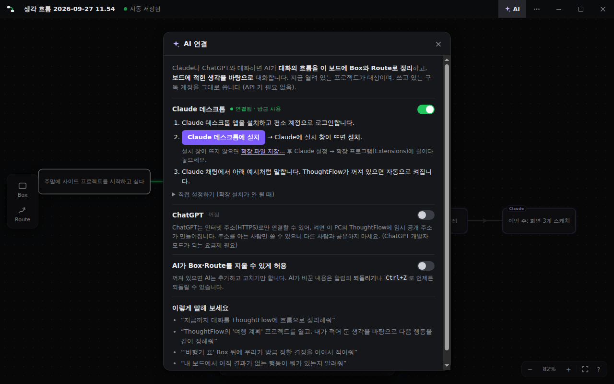

# ThoughtFlow

Box에 생각·행동·결과를 적고, 방향이 있는 **Route**로 이어서 내 사고의 흐름을 한눈에 보는 Windows 데스크톱 앱입니다.

```
[처음 생각] → [행동] → [결과] → [그래서 든 생각] → [다른 행동] → …
```


- Box 종류(Thought/Action/Result)를 강제하지 않습니다. 모든 Box는 같은 일반 Box입니다.
- Box를 클릭하면 **오른쪽 창**에서 그 생각을 길게 적을 수 있고, 창 위쪽 **탭**으로 여러 생각을 오갈 수 있습니다.
- 서로 다른 내용은 **프로젝트**로 나눠 관리합니다. 왼쪽 위 버튼을 누르면 프로젝트 목록이 왼쪽에서 나옵니다.
- 행동할 때마다 **자동 저장**됩니다. 로그인·클라우드 없이 내 PC의 파일(`.tflow`)에 저장하는 Local-first 앱입니다.
- **Claude·ChatGPT와 연결**하면 AI가 대화의 흐름을 보드에 Box와 Route로 정리하고, 보드에 적힌 생각을 바탕으로 대화합니다. 쓰고 있는 구독 계정 그대로, API 키 없이. ([아래 참고](#ai와-함께-쓰기-claude--chatgpt))
- 검은색 테마.


> 📖 **처음이라면 → [쉬운 사용 설명서](docs/사용설명서.md)** (3분 만에 시작하기, 화면 안내, 단축키, 자주 묻는 질문)

## 실행하기

필요한 것: [Node.js](https://nodejs.org/) 20 이상 (Windows 10/11)

```bash
cd thoughtflow
npm install
npm run dev        # 개발 모드 (코드 수정 시 화면 자동 갱신)
npm start          # 빌드 후 실행
```

### Windows 설치 파일 만들기

```bash
npm run dist       # release/ThoughtFlow-Setup-0.5.0.exe 생성
```

설치하면 `.tflow` 파일을 더블클릭해 바로 열 수 있습니다.
설치 없이 실행 폴더만 필요하면 `npm run dist:dir` → `release/win-unpacked/ThoughtFlow.exe`.

## 사용법

| 하고 싶은 것 | 방법 |
|---|---|
| **프로젝트** | 프로그램 바 왼쪽 위 **프로젝트 버튼** → 왼쪽에서 프로젝트 창이 나옴 → **+ 새 프로젝트**(이름 입력) 또는 **이전 프로젝트 클릭**으로 전환 (`Ctrl+N` = 새 프로젝트) |
| 프로젝트 이름 바꾸기 / 삭제 | 프로젝트 창에서 항목에 마우스를 올리면 나오는 ✎ / 🗑 (삭제는 휴지통으로 옮김) |
| **프로그램 바** | 맨 위 막대: 최소화 · 최대화/이전 크기 · 닫기, `⋯` = 파일/편집/보기 메뉴, 빈 곳을 끌면 창 이동 · 더블클릭하면 최대화 |
| Box 만들기 | 왼쪽 Toolbar의 **Box**를 Board로 끌어다 놓기 · 빈 곳 **더블클릭** (Box 버튼 클릭 = 화면 중앙에 생성) |
| **생각 적기** | Box **클릭** → 오른쪽 창이 열리고 제목과 메모를 자유롭게 작성 (제목을 고치면 Box도 바뀜) |
| 창 닫기 / 다시 열기 | 창 오른쪽 위 **×** 로 닫기 → 닫은 뒤에는 클릭해도 열리지 않고, Box **더블클릭**으로 다시 열기 |
| 창 전환 | 창 위쪽에 한 줄로 나열된 **탭** 클릭 · 창 안의 들어온/나간 흐름 클릭 · 탭 ×(또는 휠 버튼)로 탭 닫기 |
| 창 너비 | 창 왼쪽 가장자리를 끌어서 조절 |
| Box 글 바로 고치기 | 새 Box는 바로 입력 상태 · 선택 후 `Enter` · `Enter`는 줄바꿈 · `Esc`/바깥 클릭으로 완료 |
| **다음 생각 잇기** | Box **테두리**에서 끌어내 빈 곳에 놓기 → 새 Box가 생기고 바로 입력 |
| Box끼리 연결 | Box 테두리에서 끌어 다른 Box 위에 놓기 |
| 자유롭게 Route 그리기 | Toolbar **Route**(`R`) → 빈 곳에서 그리기 → 양 끝에 Box 자동 생성 |
| 입력하며 흐름 따라가기 | 편집 중 `Tab` = 다음(나가는) Box, `Shift+Tab` = 이전(들어오는) Box |
| 방향 바꾸기 | Route 가운데의 **화살표 클릭** |
| 선 정리 | 따로 할 일 없음 — 그린 선은 **자동으로 매끈하게** 정리되고(큰 곡선은 유지), 거의 곧게 그으면 깔끔한 연결선이 됨 |
| Box를 옮기면 | 연결된 Route가 **새 위치에 맞게 자동으로 다시 이어짐** (위아래로 놓이면 아래↔위 면, 옆으로 놓이면 오른쪽↔왼쪽 면) |
| 흐름 추적 | Box를 클릭하면 들어온 Route는 **보라**, 나간 Route는 **초록**으로 강조 |
| **검색** | `Ctrl+F` → 키워드가 제목이나 메모에 들어 있는 창 목록 표시 · Board에서 해당 Box 강조 · 결과를 누르면 그 창이 열리고 메모 안의 키워드가 표시됨 (`Enter` = 다음 결과, `Esc` = 닫기) |
| 이동 / 삭제 | Box 본문 드래그 / Box·Route **우클릭 → 삭제** 또는 `Delete` (Box를 지우면 연결된 Route도 삭제) |
| 화면 이동 | 빈 곳 드래그 · 휠 버튼 드래그 · `Space`+드래그 |
| 확대/축소 | 마우스 휠 · `Ctrl +/-/0` · 전체 보기 `Shift+1` |
| 되돌리기 | `Ctrl+Z` / 다시 실행 `Ctrl+Y` 또는 `Ctrl+Shift+Z` |
| **저장** | 글쓰기·Box 편집 등 행동할 때마다 **자동 저장** · `Ctrl+S` = 바로 저장 · 다른 이름으로 `Ctrl+Shift+S` |
| 파일 | 새 프로젝트 `Ctrl+N` · 다른 위치의 파일 열기 `Ctrl+O` |

### 프로젝트와 저장 위치

- 프로젝트 하나 = `.tflow` 파일 하나이고, `문서\ThoughtFlow\프로젝트 이름.tflow`로 저장됩니다. 프로젝트 창의 **저장 폴더 열기**로 바로 볼 수 있습니다.
- 프로젝트를 전환하면 지금 프로젝트는 저장된 뒤 닫히고, 다시 돌아오면 보던 화면 위치와 오른쪽 창의 탭이 그대로 돌아옵니다.
- 이름을 정하지 않고 시작한 보드는 `생각 흐름 날짜 시각.tflow`로 자동 저장되며, 프로젝트 창에서 이름을 바꿀 수 있습니다. (빈 보드는 파일을 만들지 않습니다)
- `Ctrl+O`로 다른 위치의 파일을 열거나 `Ctrl+Shift+S`로 다른 위치에 저장하면, 그 파일도 프로젝트 목록에 함께 나옵니다.
- 앱을 다시 실행하면 마지막으로 쓰던 프로젝트가 열립니다.
- 프로그램 바의 프로젝트 이름 옆에 저장 상태(`자동 저장됨` / `저장 중…` / `저장 실패`)가 표시됩니다.

오른쪽 아래 `?` 버튼을 누르면 앱 안에서도 사용법을 볼 수 있습니다.

## AI와 함께 쓰기 (Claude · ChatGPT)

Claude나 ChatGPT와 평소처럼 대화하면, AI가 **대화의 흐름을 ThoughtFlow 보드에 Box와 Route로 정리**하고
**보드에 적어 둔 내 생각을 읽고 그걸 바탕으로** 대화합니다. 지금 ThoughtFlow에 열려 있는 프로젝트가 대상입니다.

- 이미 쓰고 있는 **구독 계정(Claude Pro, ChatGPT Plus 등)을 그대로** 씁니다. API 키나 추가 요금이 필요 없습니다.
- AI가 만든 Box에는 작은 `Claude`/`ChatGPT` 표시가 붙고, 방금 만든 Box는 잠깐 빛납니다.
- AI가 바꿀 때마다 아래쪽에 알림이 뜨고, **되돌리기**(또는 `Ctrl+Z` 한 번)로 그 변경 전체를 취소할 수 있습니다.
- AI는 기본적으로 **추가·수정만** 합니다. 지우기는 설정에서 허용했을 때만 됩니다.


### Claude 데스크톱 연결 (추천, 1분)

1. [Claude 데스크톱 앱](https://claude.ai/download)을 설치하고 평소 계정으로 로그인합니다.
2. ThoughtFlow 프로그램 바 오른쪽의 **✦ AI** 버튼 → **Claude 데스크톱에 설치** 를 누릅니다.
3. Claude 데스크톱에 설치 창이 뜨면 **설치**를 누릅니다. 끝!
   - 설치 창이 뜨지 않으면 같은 곳의 **확장 파일 저장…** 으로 `ThoughtFlow.mcpb`를 저장한 뒤, Claude 설정 → 확장 프로그램(Extensions) 화면에 끌어다 놓으세요.
4. Claude 채팅에서 이렇게 말해 보세요.
   - “지금까지 대화를 ThoughtFlow에 흐름으로 정리해줘”
   - “ThoughtFlow의 ‘여행 계획’ 프로젝트를 열고, 내가 적어 둔 생각을 바탕으로 다음 행동을 같이 정해줘”
   - “‘비행기 표’ Box 뒤에 우리가 방금 정한 결정을 이어서 적어줘”
   - Claude 입력창의 **+** 메뉴에 있는 ThoughtFlow 프롬프트(대화 정리하기 / 보드를 바탕으로 이야기하기)도 쓸 수 있습니다.

ThoughtFlow가 꺼져 있어도 Claude가 도구를 쓰면 자동으로 켜집니다. (처음 한 번은 ThoughtFlow를 직접 실행해 두어야 합니다)
모든 내용은 이 PC 안에서만 오갑니다(127.0.0.1, 실행할 때마다 바뀌는 비밀 토큰).

### ChatGPT 연결 (선택)

ChatGPT는 인터넷 주소(HTTPS)로만 앱에 연결할 수 있어서 준비가 조금 더 필요합니다. ChatGPT의 **개발자 모드**가 되는 요금제가 필요합니다.

1. [cloudflared](https://developers.cloudflare.com/cloudflare-one/connections/connect-networks/downloads/)(무료)를 설치합니다. 명령 프롬프트에서:
   ```
   winget install --id Cloudflare.cloudflared
   ```
2. ThoughtFlow의 **✦ AI** → **ChatGPT** 스위치를 켭니다. 잠시 뒤 `https://….trycloudflare.com/mcp/…` 주소가 나오면 **복사**합니다.
3. ChatGPT 설정 → 앱 및 커넥터(Apps & Connectors) → 고급 설정에서 **개발자 모드**를 켭니다.
4. **커넥터 만들기**: 이름 `ThoughtFlow`, MCP 서버 URL = 복사한 주소, 인증 = **인증 없음**.
5. 새 채팅에서 ThoughtFlow 커넥터를 켜고 Claude와 같은 방식으로 말합니다.

> 주의: 이 주소를 아는 사람은 누구나 내 보드를 읽고 고칠 수 있으니 공유하지 마세요. 필요하면 **주소 새로 만들기**로 즉시 바꿀 수 있고,
> ChatGPT 스위치를 끄면 주소가 사라집니다. ThoughtFlow를 다시 켜면 주소가 바뀌므로 ChatGPT 커넥터의 주소도 새로 넣어 주세요.
> (ChatGPT 메뉴 이름은 업데이트에 따라 조금 다를 수 있습니다)



### AI가 쓸 수 있는 기능

| 도구 | 하는 일 |
|---|---|
| 보드 읽기 `get_board` | 열린 프로젝트의 흐름 전체(제목·메모·지금 보고 있는 Box) |
| Box 자세히 보기 `read_box` / 검색 `search_boxes` | Box의 전체 메모와 앞뒤 흐름 / 제목·메모에서 찾기 |
| 흐름 추가 `add_flow` | 새 Box와 Route를 한 번에 추가하고 **자동 배치**(왼쪽 → 오른쪽, 갈래는 아래로) |
| Box 고치기 `update_box` / 잇기 `connect_boxes` | 제목·메모 고치기(메모 뒤에 덧붙이기) / 기존 Box끼리 잇기 |
| Box 보여 주기 `focus_box` | 내 화면에서 그 Box를 가운데로 가져오고 오른쪽 창으로 열기 |
| 프로젝트 `list_projects` · `open_project` · `create_project` | 프로젝트 목록 / 전환 / 새로 만들기 |
| 지우기 `delete_items` | **✦ AI** 설정에서 “AI가 Box·Route를 지울 수 있게 허용”을 켰을 때만 |

**프로젝트 창** — 왼쪽 위 버튼을 누르면 왼쪽에서 스르륵 나옵니다


**검색** (`Ctrl+F`) — 키워드가 들어 있는 창과 Box가 표시됩니다


**흐름 강조** — Box를 선택하면 들어온 흐름은 보라, 나간 흐름은 초록


**자동 보정** — 손떨림은 사라지고 큰 곡선은 남습니다 / **Box를 옮기면** Route가 새 위치에 맞게 다시 이어집니다

| 그리자마자 자동 보정 | Box를 옮긴 뒤 |
|---|---|
|  |  |

## 구조

설계 결정(기술 선택, 데이터 모델, 알고리즘, 위험 요소)은 [`docs/DESIGN.md`](docs/DESIGN.md)에 있습니다.

```
electron/        main process (프레임 없는 창·창 조작, 메뉴, 파일/프로젝트 관리, 닫기 전 저장) + preload API
src/model/       Box/Route 데이터 모델과 순수 함수 연산
src/geometry/    벡터, 사각형, Chord 좌표계, Catmull-Rom → Bezier
src/anchors/     연결 면 선택, Anchor Distribution
src/routing/     Route 생성, 샘플링, RDP 단순화, smoothing, 보정, 렌더링용 기하 계산
src/store/       Zustand 상태 + Undo/Redo
src/interaction/ hit test, pointer 상태 머신, 단축키, 명령
src/persistence/ .tflow 파일 형식(검증 포함), 열기/저장/자동 저장
src/components/  Board, BoxView, RouteView, Toolbar, TitleBar(프로그램 바), ProjectDrawer(프로젝트 창), SidePanel(오른쪽 창·탭), SearchBar, SaveStatus, AiSettings(AI 연결 창), AiToast …
src/ai/          AI가 보드를 읽고 고치는 함수(boardOps), 자동 배치(layout), 요청 처리(aiBridge)
mcp/             MCP 서버 정의(server.ts, 도구 목록) + Claude 데스크톱 확장 진입점(stdio.ts)
electron/ai.ts   로컬 브리지(Claude), ChatGPT용 HTTPS 엔드포인트 + cloudflared 터널, AI 연결 설정
```

## 테스트

```bash
npm run typecheck
npm test           # 단위 테스트 (geometry, 보정 알고리즘, anchor, 파일 형식, undo, AI 보드 조작·자동 배치)
# e2e는 테스트 전용 임시 폴더를 쓰므로 실제 문서 폴더에 파일을 만들지 않습니다
npm run e2e        # 실제 Electron 앱을 띄워 마우스/키보드로 조작하는 시나리오 (AI 연결은 실제 MCP 클라이언트로 확인)
```

Linux(화면 없는 환경)에서는 `xvfb-run -a npm run e2e`로 실행합니다.

## 파일 형식 (`.tflow`)

JSON입니다(현재 버전 2 — 버전 1 파일도 열 수 있음). 각 Box에는 Board에 보이는 `text`와 오른쪽 창의 메모 `note`가 있고, AI가 만든 Box에는 `origin`(예: `"Claude"`)이 붙습니다. Route의 방향은 `sourceNodeId → targetNodeId`로 표현하고, 곡선은 시작/끝 Anchor를 잇는 선분 기준의
상대 좌표(`pathPoints: [u, v]`)로 저장해서 Box를 옮겨도 곡선 형태가 유지됩니다. 자세한 내용은 `src/persistence/fileFormat.ts` 참고.
