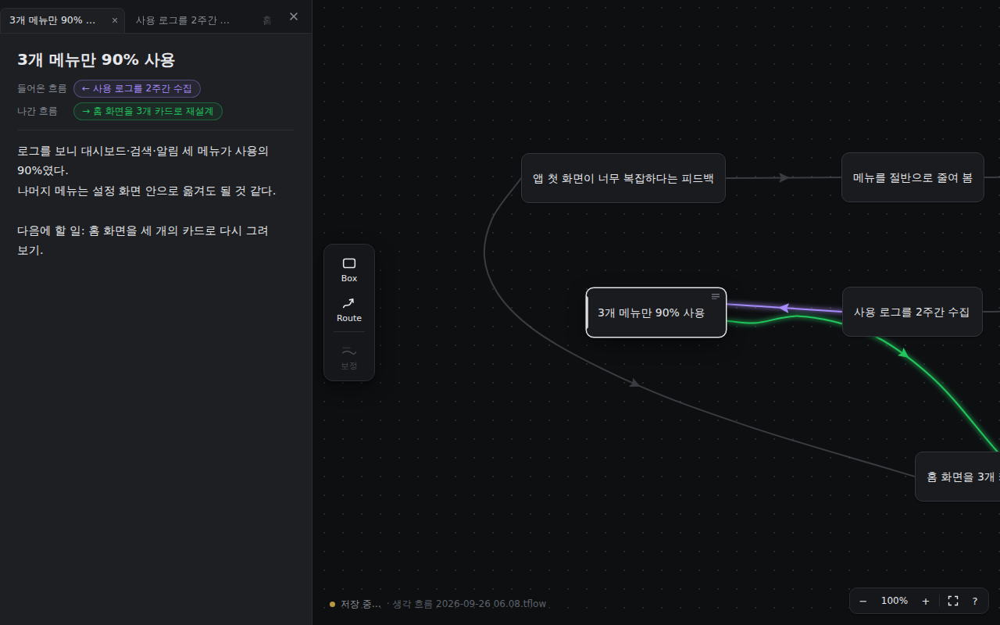
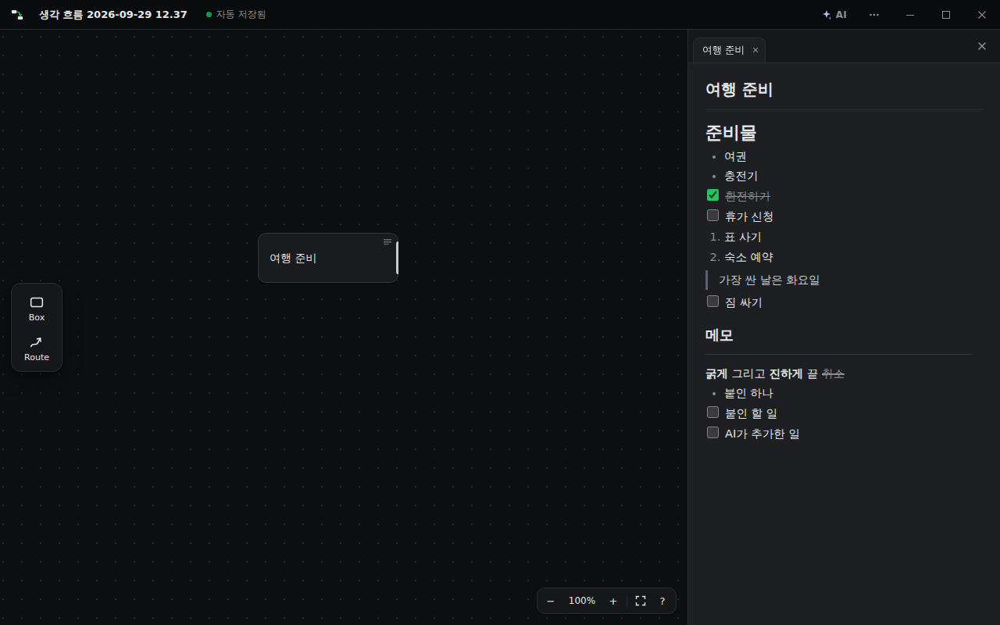
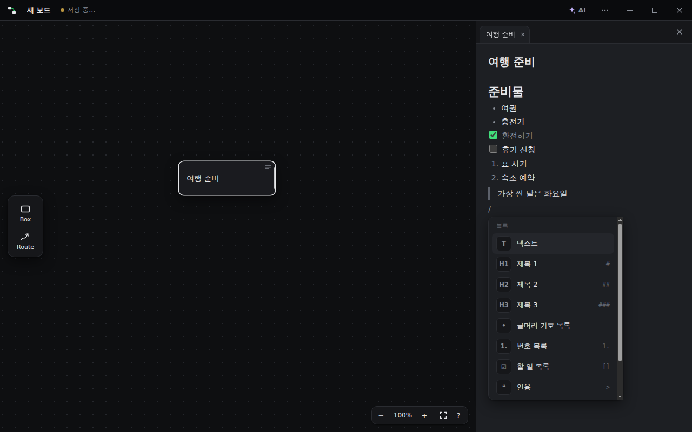
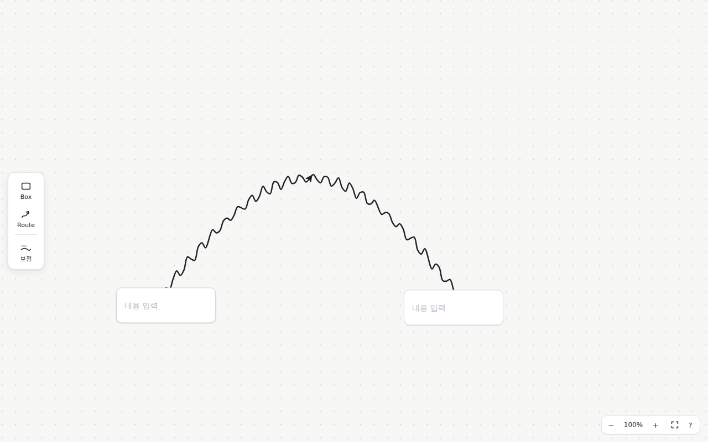
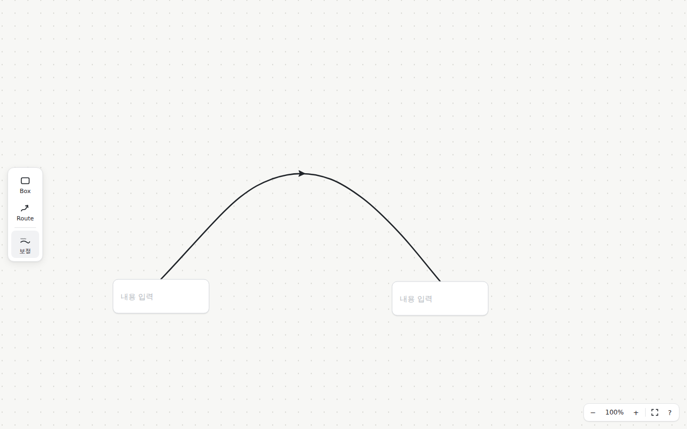
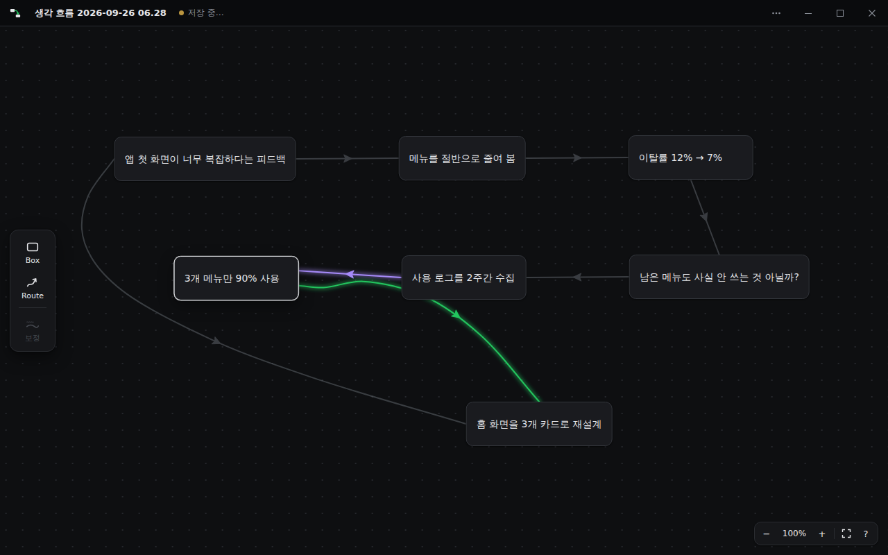
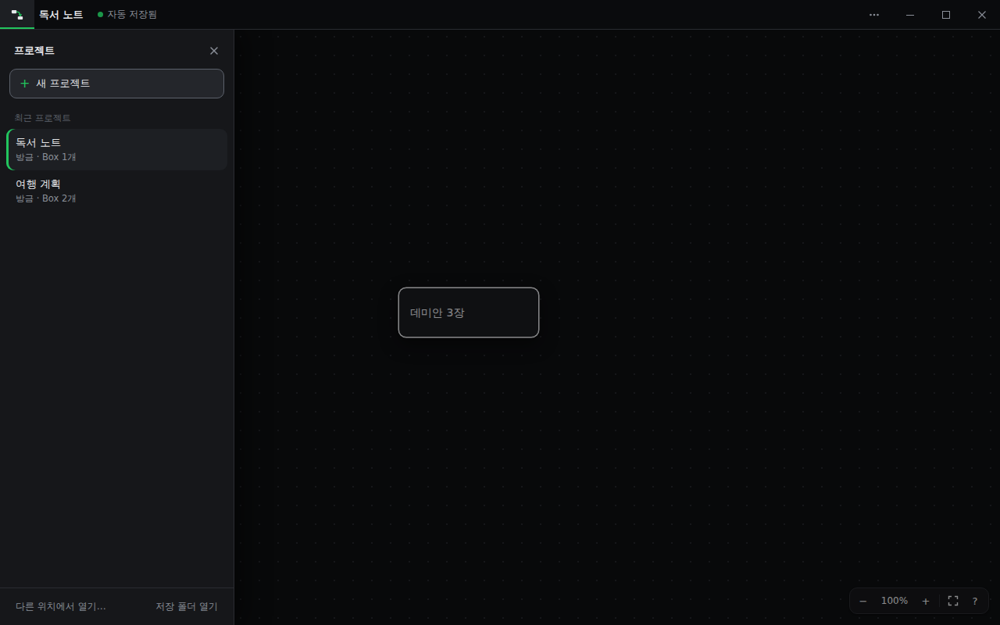
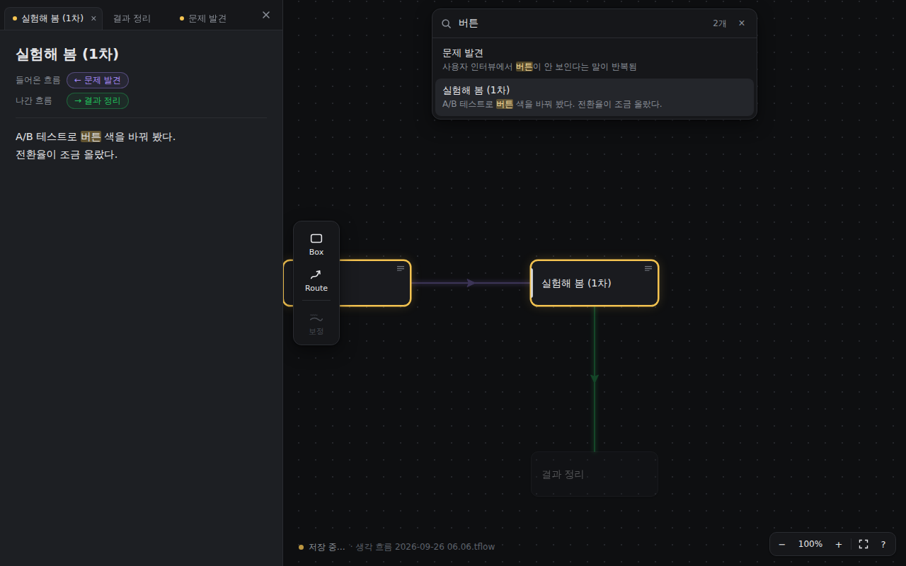
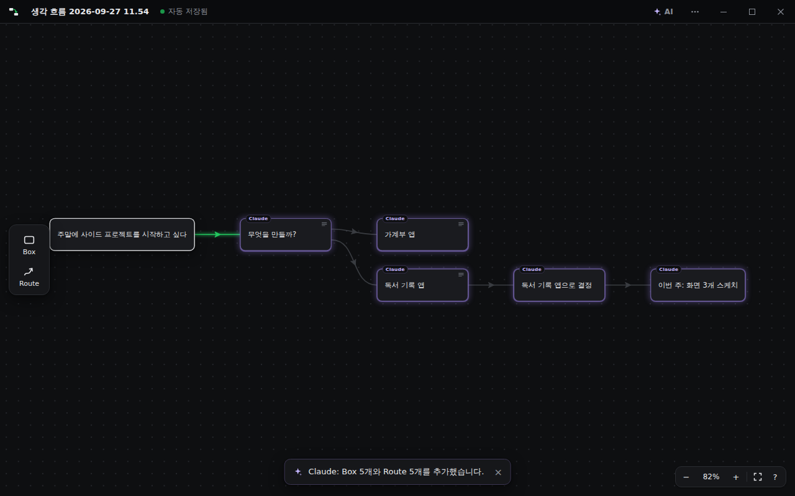

# ThoughtFlow 사용 설명서

> **한 줄 요약**: 생각을 **Box**에 적고, **선(Route)** 으로 이어서, 내 생각이 어떻게 흘러갔는지 한눈에 봅니다.

```
[처음 생각] ──▶ [해 본 행동] ──▶ [결과] ──▶ [그래서 든 생각] ──▶ …
```

저장 버튼은 신경 쓰지 않아도 됩니다. **무엇을 하든 자동으로 저장**되고, 모든 파일은 **이 PC 안에만** 저장됩니다.

---

## 💾 설치하기 (Windows 10/11)

1. **[다운로드 페이지](https://github.com/hoje05/web/releases/latest)** 를 엽니다.
2. 아래쪽 **Assets** 에서 **`ThoughtFlow-Setup-버전.exe`** 를 눌러 받습니다.
3. 받은 파일을 실행합니다.
   파란 창 **“Windows의 PC 보호”** 가 뜨면 → **추가 정보** → **실행** 을 누르세요.
   (서명 인증서가 없어서 뜨는 안내예요. 바이러스라는 뜻이 아니에요)
4. 설치 폴더를 고르고 **설치** → 시작 메뉴의 **ThoughtFlow** 로 켜면 끝!

> 새 버전이 나오면 같은 방법으로 설치하면 됩니다. 만들어 둔 프로젝트는 그대로 남아요.

---

## 📌 3분 만에 시작하기

| 순서 | 이렇게 하세요 | 결과 |
|:---:|---|---|
| **1** | 빈 곳을 **더블클릭** | 새 Box가 생기고 바로 글을 쓸 수 있어요 |
| **2** | 생각을 적고 **Esc** | Box 완성 |
| **3** | Box **테두리**에 마우스를 대고 **끌어서** 빈 곳에 놓기 | 선이 이어진 새 Box가 생겨요 |
| **4** | 다음 생각을 적고 **Esc** | 흐름 완성! 3번을 반복하세요 |

> 💡 **테두리 vs 가운데**
> Box **가운데**를 끌면 → Box가 **움직여요**
> Box **테두리**를 끌면 → **선이 나와요** (마우스가 `+` 모양으로 바뀌면 테두리예요)

---

## 🧭 화면 둘러보기

```
┌─────────────────────────────────────────────────────────────┐
│ [▣] 프로젝트 이름 · 자동 저장됨          ✦AI  ⋯  ─  □  ✕  │ ← 프로그램 바
├──────┬──────────────────────────────────────┬───────────────┤
│ Box  │                                      │  탭  탭  탭   │
│      │        생각을 그리는 보드              │───────────────│
│Route │   [생각] ──▶ [행동] ──▶ [결과]        │  제목          │
│      │                                      │  메모 쓰는 곳   │
│ 도구  │                          −100%+ ⛶ ? │  (오른쪽 창)    │
└──────┴──────────────────────────────────────┴───────────────┘
```

| 위치 | 이름 | 하는 일 |
|---|---|---|
| 왼쪽 위 `▣` | 프로젝트 버튼 | 프로젝트 목록 열기 / 새 프로젝트 |
| 위쪽 `✦ AI` | AI 버튼 | Claude · ChatGPT 연결 |
| 왼쪽 | 도구 막대 | Box 만들기, Route(자유 선) 그리기 |
| 오른쪽 | 생각 창 | Box의 긴 메모 쓰기 |
| 오른쪽 아래 | 확대 · 축소 · `?` | 화면 크기 조절, 앱 안 도움말 |

---

## ✏️ Box — 생각 하나 = Box 하나

| 하고 싶은 것 | 방법 |
|---|---|
| 만들기 | 빈 곳 **더블클릭** (또는 왼쪽 **Box** 버튼을 끌어다 놓기) |
| 글 고치기 | Box 클릭 후 **Enter** (끝낼 때 **Esc**) |
| 옮기기 | Box **가운데**를 끌기 |
| 지우기 | Box **우클릭 → 삭제** (또는 `Delete`) |
| 다음 Box로 바로 이동하며 쓰기 | 글 쓰는 중 **Tab** (이전 Box는 **Shift+Tab**) |

### 긴 생각은 오른쪽 창에

Box를 **클릭**하면 오른쪽에 창이 열립니다. 여기에 이유, 느낌, 자세한 내용을 마음껏 적으세요.



- 창 위쪽 **탭**을 누르면 다른 Box의 창으로 바로 넘어가요.
- 창을 **×** 로 닫으면, 다음부터는 Box를 **더블클릭**해야 다시 열려요.
- 창 왼쪽 가장자리를 끌면 폭을 바꿀 수 있어요.

### ✨ 메모 꾸미기 (Notion처럼)

메모는 **한 줄이 한 블록**이에요. 줄 맨 앞에서 이렇게 입력하면 모양이 바로 바뀌어요.



| 이렇게 입력 | 결과 |
|:---:|---|
| **`/`** | 블록 메뉴가 나와요 (제목 · 목록 · 할 일 · 인용 · 코드 · 구분선). 글자를 치면 찾아 주고, `Enter`로 골라요 |
| `# ` | 큰 제목 (`## ` 중간, `### ` 작은 제목) |
| `- ` | • 글머리 목록 |
| `1. ` | 1. 번호 목록 |
| `[] ` | ☐ 할 일 — 네모를 누르면 ☑ 체크! |
| `> ` | 인용 |
| `---` | 구분선 |
| `**글**` | **굵게** (`Ctrl+B`도 돼요) |



- 글자를 드래그해서 고르면 위에 **서식 막대**(굵게 · 기울임 · 취소선 · 코드)가 나와요.
- 목록을 끝내려면 빈 줄에서 `Enter`를 한 번 더 누르세요.
- 원래 쓰던 단축키는 메모를 쓰는 중에도 그대로예요 (`Ctrl+S` 저장, `Ctrl+F` 찾기, `Esc` 나가기, `Tab` 다음 칸 등).

---

## ➡️ Route — 생각을 잇는 선

| 하고 싶은 것 | 방법 |
|---|---|
| 새 생각 이어 붙이기 | Box **테두리**에서 끌어 **빈 곳**에 놓기 |
| 있는 Box끼리 잇기 | Box **테두리**에서 끌어 **다른 Box 위**에 놓기 |
| 자유롭게 그리기 | 왼쪽 **Route** 버튼(또는 `R`) → 아무 데나 그리기 → 양 끝에 Box가 자동으로 생겨요 |
| 방향 바꾸기 | 선 가운데의 **화살표 클릭** |
| 지우기 | 선 **우클릭 → 삭제** |

✨ **대충 그려도 괜찮아요.** 삐뚤빼뚤한 선은 자동으로 매끈해지고, Box를 옮기면 선이 알아서 따라와 다시 이어집니다.

| 그리자마자 자동 정리 | Box를 옮기면 선도 따라와요 |
|---|---|
|  |  |

### 흐름 따라가기 (색깔 뜻)

Box를 클릭하면:

- 🟣 **보라색 선** = 이 생각으로 **들어온** 흐름 (원인, 이전 생각)
- 🟢 **초록색 선** = 이 생각에서 **나간** 흐름 (결과, 다음 행동)



---

## 🗂️ 프로젝트 — 주제별로 나눠 쓰기

"여행 계획", "회사 일", "공부" 처럼 **주제마다 따로** 관리할 수 있어요.

1. 왼쪽 위 **▣ 버튼** 클릭 → 왼쪽에서 프로젝트 창이 나와요.
2. **+ 새 프로젝트** (또는 `Ctrl+N`) → **텅 빈 새 보드가 바로 열려요.**
3. 이름을 바꾸려면 맨 위 막대의 **프로젝트 이름을 클릭** → 새 이름 입력 → Enter
4. 목록에서 **이전 프로젝트를 클릭**하면 그 보드로 전환돼요.



- 목록의 이름에 마우스를 올리면 ✎(이름 바꾸기) · 🗑(휴지통으로) 버튼이 나와요.
- 전환할 때 지금 보던 화면과 열린 탭이 그대로 기억돼요.
- 파일은 **이 PC의 `C:\Users\내 이름\ThoughtFlow`** 폴더에만 저장돼요. 인터넷(OneDrive 등)으로 올라가지 않아요.
  프로젝트 창 맨 아래에 저장 위치가 보이고, **저장 폴더 열기**로 바로 열 수 있어요.

---

## 🔍 찾기

**Ctrl+F** → 단어 입력 → 그 단어가 들어 있는 Box가 반짝이고 목록이 나와요. 목록을 누르면 바로 그 메모로 이동!



---

## ✦ AI와 함께 쓰기 (Claude · ChatGPT)

AI와 평소처럼 대화하면, **AI가 대화 내용을 보드에 Box와 선으로 정리**해 주고 **내가 적어 둔 생각을 읽고** 대답해요.
지금 쓰는 계정 그대로 쓰며, API 키나 추가 요금이 필요 없어요.



### Claude 연결 (1분)

1. [Claude 데스크톱 앱](https://claude.ai/download)을 설치하고 로그인
2. ThoughtFlow 위쪽 **✦ AI** → **Claude 데스크톱에 설치**
3. Claude에 뜬 창에서 **설치** → 끝!

### 이렇게 말해 보세요

- 💬 "지금까지 대화를 ThoughtFlow에 정리해줘"
  → Claude가 **새 프로젝트**를 만들고, 그 빈 보드에 생각·행동·결과를 Box와 선으로 그려 줘요.
  ThoughtFlow 창도 그 프로젝트로 바뀌어요. (다른 창을 보고 있었다면 작업 표시줄의 ThoughtFlow가 깜빡여요)
- 💬 "ThoughtFlow의 '여행 계획'을 보고 다음에 뭘 하면 좋을지 같이 생각해줘"
- 💬 "지금 보드의 '비행기 표' Box 뒤에 방금 정한 걸 이어서 적어줘"

### 안심하세요

- AI가 만든 Box에는 작은 **Claude / ChatGPT** 표시가 붙어요.
- AI가 무언가 바꾸면 아래에 알림이 뜨고, **되돌리기** 한 번이면 원래대로!
- AI는 기본적으로 **지우지 못해요.** (✦ AI 설정에서 허용했을 때만)
- 보드 파일은 이 PC에만 저장돼요. 다만 AI에게 부탁한 내용은 평소 대화처럼 그 AI 회사 서버에서 처리돼요.

> 🔄 **ThoughtFlow를 새 버전으로 설치했다면** ✦ AI → **Claude 데스크톱에 설치**를 한 번 더 눌러 주세요. Claude 쪽도 새 버전이 돼요.

> ChatGPT 연결은 준비가 조금 더 필요해요 → [README의 ChatGPT 연결](../README.md#chatgpt-연결-선택) 참고

---

## ⌨️ 단축키 한눈에

| 키 | 기능 | 키 | 기능 |
|---|---|---|---|
| 더블클릭 | 새 Box | `Ctrl+Z` | 되돌리기 |
| 메모에서 `/` | 블록 메뉴 | `Ctrl+B` | 메모 굵게 |
| `Enter` | Box 글 고치기 | `Ctrl+Y` | 다시 실행 |
| `Esc` | 글쓰기 끝 | `Ctrl+F` | 찾기 |
| `Tab` | 다음 Box로 | `Ctrl+S` | 바로 저장 |
| `R` | 자유 선 그리기 | `Ctrl+N` | 새 프로젝트 |
| `Delete` | 선택한 것 지우기 | `Shift+1` | 전체 보기 |
| 마우스 휠 | 확대 / 축소 | 빈 곳 드래그 | 화면 이동 |

---

## ❓ 자주 묻는 질문

**Q. 저장은 어떻게 하나요?**
A. 안 해도 돼요. 무엇을 하든 자동 저장돼요. 위쪽에 `자동 저장됨`이 보이면 안전해요.

**Q. 실수로 지웠어요!**
A. `Ctrl+Z`를 누르세요. 몇 번이든 되돌릴 수 있어요.

**Q. 오른쪽 창이 안 열려요.**
A. 창을 × 로 닫았다면 Box를 **더블클릭**하세요.

**Q. Box를 끌었는데 움직이지 않고 선이 나와요.**
A. 테두리를 잡은 거예요. Box **가운데**를 잡고 끌어 보세요.

**Q. 보드가 너무 커져서 어디 있는지 모르겠어요.**
A. `Shift+1`(또는 오른쪽 아래 ⛶)을 누르면 전체가 한 화면에 들어와요.

**Q. 앱을 껐다 켜면요?**
A. 마지막으로 쓰던 프로젝트가 그대로 열려요.

**Q. 예전에 `문서\ThoughtFlow`에 있던 프로젝트는요?**
A. 새 버전을 처음 켤 때 새 저장 폴더(`C:\Users\내 이름\ThoughtFlow`)로 자동 복사돼요. 원본은 그대로 남으니, 확인한 뒤 지워도 돼요.

**Q. 위쪽에 `저장 실패`가 떠요.**
A. 백신이나 Windows 보안이 폴더를 막고 있거나 디스크가 가득 찬 경우예요. `저장 실패`를 누르면 다시 저장해요.
계속되면 백신 설정에서 ThoughtFlow를 허용해 주세요.

**Q. Claude가 "ThoughtFlow가 응답하지 않는다"고 해요.**
A. ThoughtFlow 창을 열어 위쪽 저장 상태를 확인하세요. 문제가 계속되면 ThoughtFlow를 껐다 켜고 다시 부탁하세요.

---

앱 안에서도 오른쪽 아래 **`?`** 버튼을 누르면 간단한 도움말을 볼 수 있어요.
